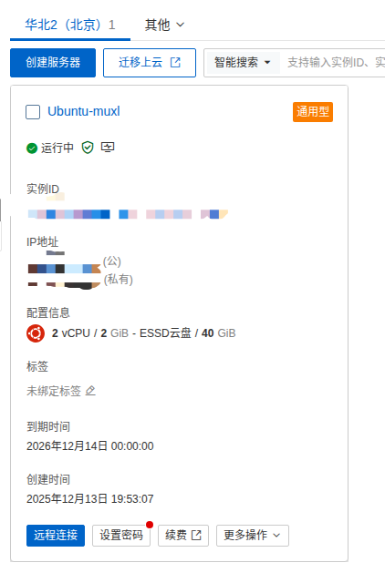
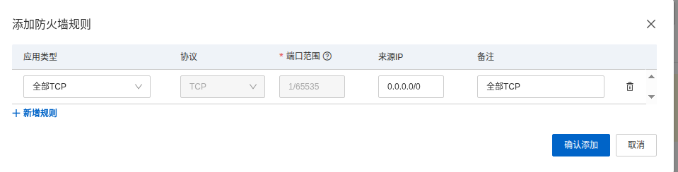
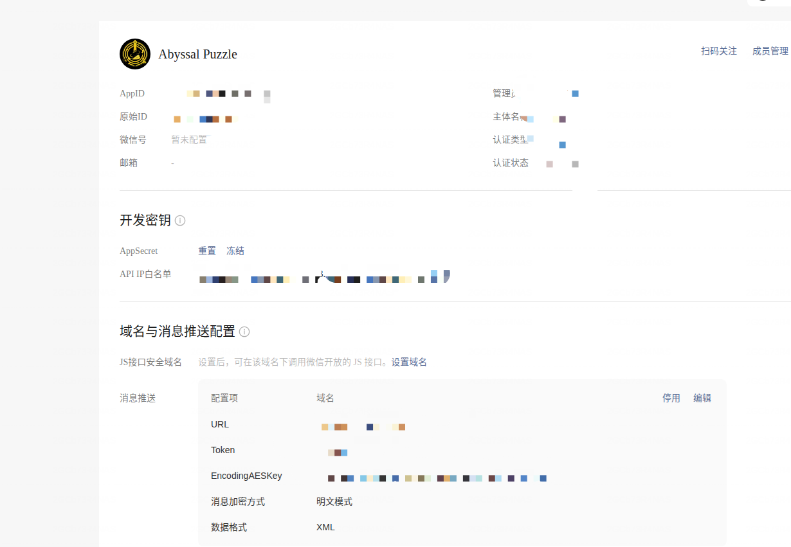
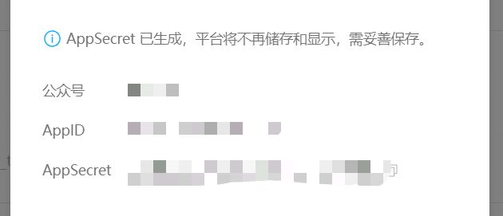
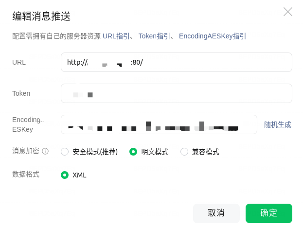
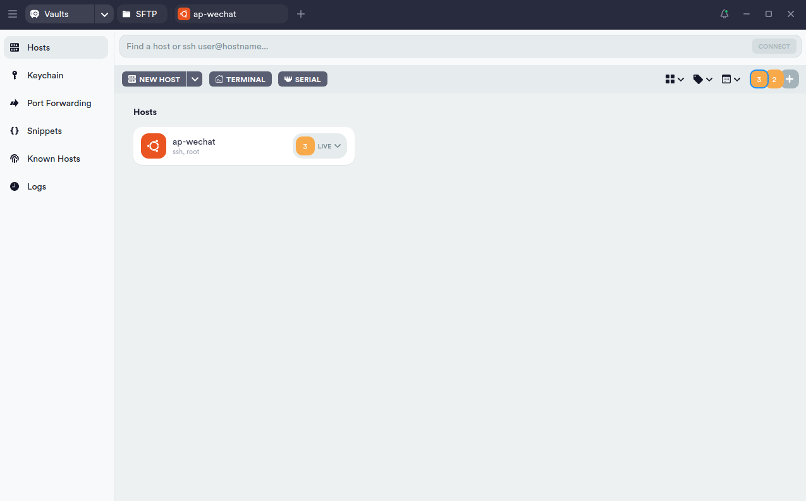
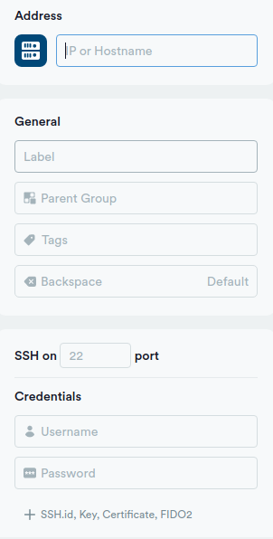
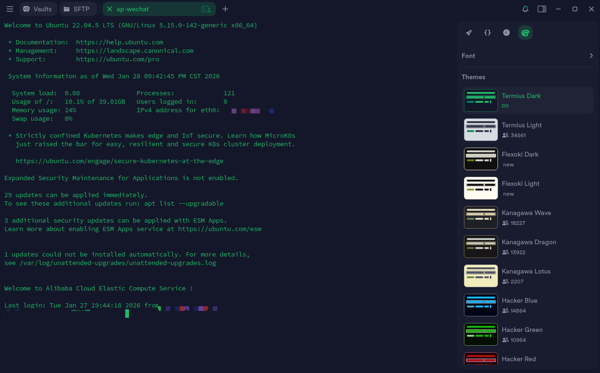
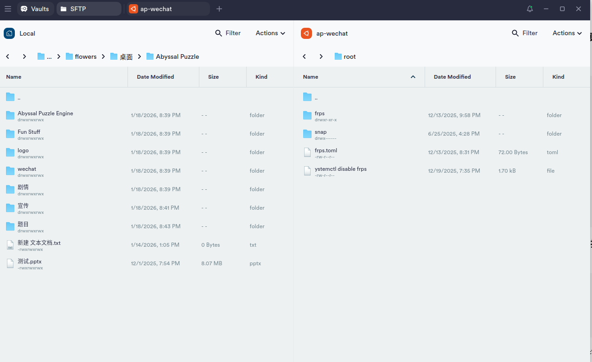

<font face="黑体">

# Abyssal Puzzle公众号系统(ap-wechat)教程
## 前言
Abyssal Puzzle 公众号系统`ap-wechat`是为**公众号Puzzle Hunt**提供的新选择，相比功能单一的自动回复，使用公众号开发可以实现**队伍系统、货币系统、预设提示**等功能，提高了基于公众号Puzzle Hunt的上限。

说明：

1.如果不是确实缺少技术力，**强烈建议使用完备的网站Hunt引擎(如CCXC、P&KU Site等)**，无论是使用的方便程度还是用户体验上都要显然高于本系统，此系统只是部署较为方便，但上限不高。

2.本系统很多功能暂时较为粗糙，后续可能会优化后发布新版本，当然也欢迎进行二次开发！

在阅读后续教程前，可以评估一下该系统是否适用于你在筹备的Puzzle Hunt后再进行使用。该系统的适用条件大概有以下几条：
<ul>
<li><strong>能够购买一台服务器。</strong></li>
<li><strong>公众号能够进行年满18周岁的实名认证。</strong></li>
<li><strong>题目基于公众号文章发布，无需实现题目宽度或其他更复杂的功能。</strong></li>
<li><strong>熟悉JSON文件的语法和结构。</strong></li>
<li><strong>熟悉Python与SQLite。（降低开发门槛，但不是必须）</strong></li>
</ul>

## 准备工作与部署
### 购买服务器
你可以先在腾讯云或<a href="https://www.aliyun.com/minisite/goods">阿里云</a>等平台购买一台轻量服务器。该系统对配置要求不高，2核CPU、1G内存以上即可。系统建议选择**Ubuntu 22.04**（下文以这个为例）或者其他你熟悉命令行操作的系统，地域选择国内任意地区即可。

接下来进入控制台，创建一个实例，设置好密码。记住这里的公网IP，后面会用到。


进入防火墙设置，添加防火墙规则，放通全部TCP端口。



### 设置微信公众号
在进行此步骤前，请确保你已经拥有了一个个人公众号。

登录<a href="https://developers.weixin.qq.com/platform">微信开发者平台</a>，进入“公众号”，你可以看到如下界面：



接下来需要完成以下配置，有些内容后面会用到：

#### 生成AppSecret
点击AppSecret后的“生成”（这里已经生成过所以没有显示）



**请妥善保存这里显示的AppSecret**，关闭此窗口后将不再显示。

#### 添加API IP白名单
点击API IP白名单后的“编辑”，把你的**服务器公网IP**填写进去即可。

#### 消息推送
点击API IP白名单后的“编辑”，URL填写为`http://服务器公网IP:80/`，Token、EncodingAESKey可以随机生成，消息加密选择明文模式<font size="2px" color="grey">（如果有大佬愿意二次开发可以补充一下安全模式的加解密逻辑QAQ）</font>，如下图：


### 下载SSH工具
SSH工具可以帮我们远程操控服务器。这里以Termius为例，请现在<a href="https://termius.com/">官网</a>注册账号后下载客户端。


点击NEW HOST链接一个新主机，IP or Hostname填写服务器的公网IP，Label任意，Username填写root，Password填写最开始服务器的密码。完成后点击Connect即可进入服务器终端。




执行以下命令：
```bash
sudo apt update
sudo apt-get update

sudo apt-get install vim
sudo apt install at
```

### 部署
如果你是Windows系统，请确保你已经安装了Python和git，安装可以参考网上教程。

集成开发环境(IDE)建议选择VSCode。

**使用git克隆本仓库到你的工作空间。建议先克隆到本地，方便修改。**

克隆完成后，在`ap-wechat`文件夹打开终端，然后在终端执行以下命令：
```bash
# 创建虚拟环境
python -m venv .venv

# 激活虚拟环境，以下两种根据你的终端类型选择
.\venv\Scipts\Activate.ps1  # powershell

cd .venv/bin
source activate # Ubuntu

# 安装依赖
pip install -r requirements.txt
```
**复制一份**`.env.example`**，重命名为**`.env`**，并按照上面准备工作时获得的内容，替换掉对应的xxx**：
```
AppSecret = "xxx"
AppID = "xxx"
token = "xxx"
EncodingAESKey = "xxx"
```
填写完毕后，将整个`ap-wechat`文件夹使用SFTP移动到服务器上。打开Termius的SFTP，在Hosts一栏双击你刚刚添加的服务器，就可以看到服务器的目录结构：



把刚刚设置好的项目文件夹拖到适合的目录（**例如`/home`，下文以这个为例**），并复制它在服务器系统的路径。

切换到服务器终端，先创建一个系统服务：
```bash
sudo vim /etc/systemd/system/wechat-official.service
```
进入vim界面，粘贴以下内容：
```service
[Unit]
Description=My Python Script
After=network.target

[Service]
Type=simple
User=wechatbot
WorkingDirectory=/home/ap-wechat
ExecStart=/home/ap-wechat/.venv/bin/python /home/ap-wechat/main.py
Restart=always
RestartSec=5
Environment=PYTHONUNBUFFERED=1
AmbientCapabilities=CAP_NET_BIND_SERVICE
CapabilityBoundingSet=CAP_NET_BIND_SERVICE

[Install]
WantedBy=multi-user.target
```
输入`:wq`回车保存。

执行以下指令启动：
```bash
# 激活虚拟环境
cd /home/ap-wechat
cd .venv/bin
source activate
cd /home/ap-wechat
# 设置可执行权限
sudo chown -R wechatbot /home/ap-wechat
# 初始化数据库
python db_init.py
# 启动系统服务
systemctl start wechat-official.service
```
接下来，在你的公众号后台发送指令（例如 /帮助），如果后台有回应，恭喜你部署成功！如果有报错，可以询问大模型或询问我。

## 简单使用
一般来说，对该系统的简单使用不需要二次开发，只需要修改一些数据即可。

### 设置谜题信息
谜题有关的信息储存在`data/puzzle_info.json`内。格式大致如下，你也可以参考原来的写法。

```json
{
    "chapters":
    [
        {
        "id": 1,
        "name": "钟楼",
        "news_description": " ",
        "news_img" : "https://mmbiz.qpic.cn/mmbiz_jpg/x0lwngPKUjhMkafUHVrsOPDlJJB0DnCrnClD2ZRVMk7fArPaw6g4UjG8Nemr1toia21r0jGiaOsUk3G5rZBjLbCA/640?wx_fmt=jpeg&from=appmsg",
        "news_url" : "https://mp.weixin.qq.com/s/FSRUGnkPtm73xadIATbF4Q",
        "puzzle_count": 5,
        "count_demand": 4,
        "puzzle":[
                {
                    "id": 1,
                    "name": "一道题目",
                    "hints": [
                        {
                            "id": 1,
                            "title" :  "我毫无头绪。", 
                            "content": "你可以xxxxx。",
                            "cost": 100
                        },
                        {
                            "id": 2,
                            "title" : "该如何提取？", 
                            "content": "使用xxxxx",
                            "cost": 200
                        }
                    ],
                    "milestone": [
                        {"id": 1,
                        "content" : "milestone",
                        "response" : "这是一个里程碑！"}
                    ] ,
                    "answer": "HELLO WORLD"
                }
            ]
        }
}
```
谜题信息存储在不同章节`chapter`内，每个`chapter`对应一条**图文消息**（如下图），属性说明如下：


`id`：从 1 开始，按顺序填写即可。

`name`：**章节名称**，建议短一些，方便指令输入。

`news_description`：灰色小字部分的描述。

`news_img`：**图片链接**，建议把图片上传到公众号的**素材库**然后复制链接即可。

`news_url`：**点击图文消息跳转链接**，比如可以使用你**提前群发的谜题文章。当然，不需要一定是一篇公众号文章，你也可以直接使用腾讯文档链接或者其他你想要使用的链接**。

`puzzle_count`：**该章节的题目数量。**

`count_demand`：**解锁下一章节需要的题目数量**。 Abyssal Puzzle由于没有分区 META，所以采用了这种形式。**如果你想要添加分区 META，建议把 META 单独作为下一个章节，这个题目数量就是解锁 META 需要的题目数量。**

`puzzle`：**该章节内所有题目信息**，是一个列表。

#### 每个`chapter`内有若干道谜题`puzzle`，`puzzle`的属性说明如下：

`id`：从 1 开始，按顺序填写即可。

`name`：**题目名称**，这个对长度没有要求。

`hints`：**提示列表**，每个提示的属性如下：
```json
{
    "id": 1,                       // 提示id，从 1 开始即可
    "title" :  "我毫无头绪。",       // 提示文本
    "content": "你可以xxxxx。",     // 提示解锁后的内容
    "cost": 100                    // 解锁提示需要花费的点数
}
```
`milestone`：**里程碑列表**，每个里程碑的属性如下：
```json
{
    "id": 1,                        // 里程碑id，从 1 开始即可
    "content" : "milestone",        // 里程碑答案，就是提交这个会显示里程碑
    "response" : "这是一个里程碑！"    // 提交里程碑后返回的内容
}
```
`answer`：本题的**答案**。

另外，你可以在`ending.json`设置结局的图文消息：
```json
{
    "name": "#6 尾声",
    "description": "",
    "news_img" : "https://mmbiz.qpic.cn/mmbiz_jpg/x0lwngPKUjhAM2znz4WG9pyqHzLib4IaeuFuicC1ygfdPp52CsiaNpFpqgvsW4q8gXmVBoyU2O4rxcibiaFyDwtbvzQ/640?wx_fmt=jpeg&amp;from=appmsg",
    "news_url" : "https://mp.weixin.qq.com/s/K80qJwfiPJvgZ6HctvVaVQ"
}
```

### 设置比赛信息
打开`db_utils.py`，文件的开头存放了一些与比赛相关的信息，按需修改即可：
```python
START_TIME = datetime.datetime(2026, 1, 23, 20, 0, 0)                 # 比赛开始时间
END_TIME = datetime.datetime(2026, 1, 30, 20, 0, 0)                   # 比赛结束时间
DISABLE_SEND_MESSAGE_TIME = datetime.datetime(2026, 1, 30, 17, 0, 0)  # 禁用发消息功能的时间

# 帮助菜单链接
HELP_MENU_URL = "https://mmbiz.qpic.cn/mmbiz_png/x0lwngPKUjh73rBLVibicFtIffZibmysBJU0FTyibKM3bLqYqw4mGh1iaxQ6XEBsYDLGcicxUAjV7TKPUMd4uSBBict0g/640?wx_fmt=png&amp;from=appmsg"
# 结局文章的查看指令
VIEW_ENDING_COMMAND = "/夺取永恒核心" 
# 完赛的提示，是最后一章通过后显示的内容，可以在这里写完赛群之类内容
ENDING_INFO = f"🎉恭喜完赛！\n完赛群：951308436\n请回复 {VIEW_ENDING_COMMAND} 查看最终结局。"

TEAM_MEMBER_LIMIT = 5           # 队伍人数限制
SUBMIT_COUNT_LIMIT = 20         # 每题的提交次数限制
HINT_UNLOCK_DELAY = 1           # 提示解锁时间延迟（小时）
POINT_NAME = "星韵"              # 点数的称呼
ADD_POINT_PER_MINUTE = 30       # 每分钟增加的点数

CAN_ADD_PASSED_PUZZLE_SUBMIT_COUNT = False    #是否允许已通过题目增加次数
ADD_SUBMIT_COUNT_COST = 10000   # 增加提交次数要花费的点数
ADD_SUBMIT_COUNT = 20           # 增加的提交次数

MESSAGE_CHAR_LIMIT = 80        # 一条消息的字符数上限
MESSAGE_SHOW_LIMIT = 6          # 显示的消息条数上限，建议这两个乘积不大于500，否则可能会导致回复不出来

ADMIN_NAME = "【回响】"    # 管理员回复的站内信时显示的称呼
# 管理员ID列表
ADMIN_USER_IDS = [
                    "op1PY2xxxxxxxxxxxxxxx",
                    ]
```
这里的管理员ID列表要输入的是微信用户的OpenID，需要把Staff都添加进去。查看一位微信用户OpenID的方式如下：

在Termius进入`ap-wechat`目录，终端输入：
```bash
journalctl -u wechat-official.service -f
```
在公众号发送一条消息，终端会显示类似这样的输出：
```bash
Jan 29 15:02:10 e82ze423grsspleu8wyr4gZ python[182770]: Received message:你好 (from op1PY2xxxxxxxxxxxxxxx)
```
这里的`from op1PY2xxxxxxxxxxxxxxx`就是这名用户的OpenID。

### 应用修改
**以上两步在本地每次修改后，需要使用Termius的SFTP替换掉原来的文件，然后重新启动即可：**
```bash
cd /home/ap-wechat
cd .venv/bin
source activate
cd /home/ap-wechat
sudo chown -R wechatbot /home/ap-wechat
systemctl restart wechat-official.service
```

### 开赛准备
**在你的Hunt开放正式队伍注册前，请务必先进行一次内部的全流程测试。**

确定没有问题之后，在SFTP删除原来的`abyssal_puzzle.db`数据库，运行`db_init.py`重新创建一个：
```bash
cd /home/ap-wechat
python db_init.py
```
然后，我们需要**使用at创建定时任务，实现定时开赛**。把下面指令的时间部分替换为你的开赛时间：
```bash
at 20:00 23.01.2026
```
接下来输入：
```bash
/home/ap-wechat/.venv/bin/python3 /home/ap-wechat/start.py >> /home/ap-wechattest.log 2>&1
```
按CTRL+D保存即可。可以使用`atq`查看当前的定时任务。

由于一些神秘的原因，我们还需要**使用crontab进行服务的定时重启**。
```bash
sudo crontab -e
```
接下来输入：
```bash
0 */1 * * * systemctl restart wechat-official
```
输入`:wq`保存退出。

经过以上设置，你就成功使用了`ap-wechat`系统来进行公众号PuzzleHunt的设置！

### 二次开发
由于本项目开发过程十分紧凑，导致很多接口的实现都较为粗糙，不好扩展，欢迎有能力的使用者进行二次开发。你可能需要使用frp工具来配置内网穿透等，如有疑问可以联系我。

以下是你可能会用到的参考资料：
<a href="https://werobot.readthedocs.io/zh-cn/latest/index.html">WeRobot</a>
<a href="https://developers.weixin.qq.com/doc/subscription/guide/">微信开发者文档</a>


感谢支持ap-wechat。
</font>
